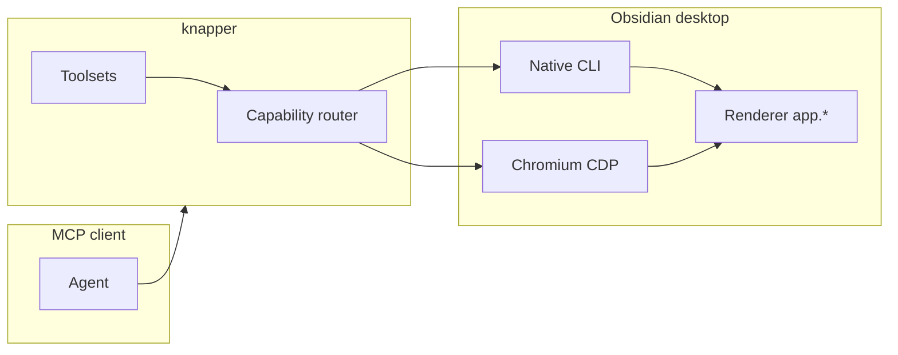

# knapper

MCP server that drives a **live Obsidian desktop app** for plugin development: native CLI commands, Playwright browser automation over CDP, telemetry with cursor-based tailing, and composite dev-cycle tools.

_Knapping is the craft of shaping obsidian into tools._

> This project is not affiliated with Obsidian or Dynalist Inc. “Obsidian” is a trademark of Dynalist Inc.

## Why two transports?

Obsidian exposes two complementary automation surfaces. The server uses both; each tool picks the layer that can actually perform the work.

| Transport               | Enables                                                                                                                              | Tradeoffs                                                                                                                                                                          |
| ----------------------- | ------------------------------------------------------------------------------------------------------------------------------------ | ---------------------------------------------------------------------------------------------------------------------------------------------------------------------------------- |
| **Obsidian CLI**        | ~100+ purpose-built commands, plugin reload, vault-scoped ops, live `__completions` (including plugin `registerCliHandler` commands) | Requires global `"cli": true` in `obsidian.json`. Cannot run headlessly. When disabled, stdout is literally `Command line interface is not enabled.` (exit 0).                     |
| **Playwright over CDP** | Real mouse/keyboard input, actionability waiting, ARIA snapshots (`browser_*`), live console/network capture                         | Obsidian must be **cold-started** with `--remote-debugging-port`. Electron’s single-instance lock means adding the flag to an already-running app does nothing — fully quit first. |

Both can be active at the same time ([verified](docs/verified-environment.md)).



## Install

Requires **Node.js 20+** and **Obsidian 1.12+**.

**knapper is not published to npm or any other registry.** It installs from GitHub,
either as a pinned release tarball or straight from the default branch. See
[docs/hosts.md](docs/hosts.md) for what each host reads and how the plugin bundle is
discovered.

This repo ships two separable things: the **MCP server** (the tools) and a **plugin
bundle** (4 skills, 2 slash commands, an agent, and a rules file) that teaches an
agent how to drive them. Install the server alone, or both.

### Pinned — recommended

Install a specific release tarball, then point your client at the `knap` binary:

```bash
npm i -g https://github.com/slate-rehm/knapper/releases/download/v0.1.0/knapper-0.1.0.tgz
```

```json
{
  "mcpServers": {
    "knapper": { "command": "knap" }
  }
}
```

Every release attaches its tarball as an asset, so the URL is stable and the version
is explicit. Nothing rebuilds at runtime.

### Convenience — track the default branch

npm installs git specs natively and runs this package's `prepare` script, which
builds the TypeScript on install:

```json
{
  "mcpServers": {
    "knapper": { "command": "npx", "args": ["-y", "github:slate-rehm/knapper"] }
  }
}
```

This needs `git` on your machine and costs a TypeScript build on first run. It also
tracks whatever is on the default branch rather than a release, so prefer the pinned
form for anything you depend on.

### Cursor

Add it in **Settings → MCP**, or drop [`.mcp.json`](.mcp.json) at your project root
with either config above.

Cursor cannot install plugins from an arbitrary Git repo — the marketplace is
curated. To get the skills, use [skills.sh](#skills-only) below, or clone this repo
into `~/.cursor/plugins/local/knapper` and reload the window.

### Claude Code

```bash
# MCP server (user scope; use --scope project to write .mcp.json instead)
claude mcp add --scope user --transport stdio knapper -- npx -y github:slate-rehm/knapper

# Plugin bundle: skills, commands, agent, rules
claude plugin marketplace add slate-rehm/knapper
claude plugin install knapper@knapper
```

The `--` before `npx` is required. The two marketplace commands are also available
as `/plugin marketplace add …` and `/plugin install …` inside a session.

### Codex

```bash
codex mcp add knapper -- npx -y github:slate-rehm/knapper

codex plugin marketplace add slate-rehm/knapper
codex plugin add knapper@knapper
```

Or write `~/.codex/config.toml` by hand:

```toml
[mcp_servers.knapper]
command = "npx"
args = ["-y", "github:slate-rehm/knapper"]
```

### Skills only

To take the skills without the MCP server — they are plain `SKILL.md` files and
work in any host that reads the `.agents` convention:

```bash
npx skills add slate-rehm/knapper
```

### Any other MCP client

Run `knap` (pinned install) or `npx -y github:slate-rehm/knapper` over stdio. Every
client that speaks MCP takes some form of the `command` + `args` pair shown above.

### From source

```bash
git clone https://github.com/slate-rehm/knapper.git
cd knapper
npm install    # the prepare script builds dist/ for you
```

Then point your client at `node /absolute/path/to/dist/cli.js`.

## First run

Obsidian needs two things switched on before any of this works: its command-line
interface, and a cold start with the remote debugging port. The server diagnoses
and fixes both itself — just ask your agent to:

1. Run **`obsidian_doctor`**. It reports each precondition separately and names the
   tool that fixes it in a `fixedBy` field.
2. Apply the fixes it names — usually **`obsidian_setup_cli`** then
   **`obsidian_launch`** (which cold-starts Obsidian with the debug port).
3. Re-run `obsidian_doctor` until it is clean, then **`obsidian_status`** to confirm
   both transports are live.

Then the development loop: **`obsidian_link_plugin`** to symlink your build output
into a vault, build, and **`obsidian_dev_cycle`** to reload the plugin and report
back any console errors attributed to it.

If you installed the plugin bundle, the `obsidian-instance-setup` and
`obsidian-plugin-dev` skills walk an agent through this without you prompting it.

## Configuration

Set options via **environment variables** (and a subset via CLI flags). See [docs/configuration.md](docs/configuration.md) for examples.

| Setting             | Env var                  | CLI flag         | Default                        |
| ------------------- | ------------------------ | ---------------- | ------------------------------ |
| CDP URL             | `OBSIDIAN_CDP_URL`       | `--cdp-url`      | `http://127.0.0.1:9222`        |
| Obsidian binary     | `OBSIDIAN_BIN`           | `--obsidian-bin` | OS default                     |
| Default vault       | `OBSIDIAN_VAULT`         | `--vault`, `-v`  | (active / unset)               |
| Toolsets            | `KNAP_TOOLSETS`          | `--toolsets`     | `core,ui,telemetry,plugin-dev` |
| Log level           | `KNAP_LOG_LEVEL`         | `--log-level`    | `info`                         |
| Telemetry buffer    | `KNAP_TELEMETRY_BUFFER`  | —                | `2000`                         |
| Network capture     | `KNAP_TELEMETRY_NETWORK` | —                | `false`                        |
| CDP reconnect delay | `KNAP_RECONNECT_MS`      | —                | `2000`                         |
| Screenshot dir      | `KNAP_SCREENSHOT_DIR`    | `--output-dir`   | `./.knapper`                   |
| CLI timeout         | `KNAP_CLI_TIMEOUT_MS`    | —                | `15000`                        |
| Window match        | `OBSIDIAN_TARGET_MATCH`  | `--target-match` | (unset)                        |
| Transport           | `MCP_TRANSPORT`          | `--transport`    | `stdio`                        |
| HTTP port           | `MCP_PORT`               | `--port`         | `9223`                         |
| HTTP host           | `MCP_HOST`               | `--host`         | `127.0.0.1`                    |
| Max concurrency     | `KNAP_MAX_CONCURRENCY`   | —                | `4`                            |

`LOG_LEVEL`, `RECONNECT_MS`, and `SCREENSHOT_DIR` are also accepted as aliases; the `KNAP_`-prefixed name wins when both are set.

The default `stdio` transport is what MCP clients use. `--transport http` serves
MCP at `/mcp` (for example `http://127.0.0.1:9223/mcp`), allows one session at a
time, and binds to loopback only unless you override `MCP_HOST` — which exposes
control of your live Obsidian UI to the network. Details in
[docs/configuration.md](docs/configuration.md).

Cursor plugin `variables` and Claude `userConfig` do not unify across hosts — use plain env vars in each MCP config.

## Toolsets

Gating keeps tool count manageable for model tool selection.

| Toolset      | Default | Description                                                                                                          |
| ------------ | ------- | -------------------------------------------------------------------------------------------------------------------- |
| `core`       | yes     | Status, doctor, launch, eval, CLI, commands, attach                                                                  |
| `ui`         | yes     | `browser_*` (from `@playwright/mcp`) for real UI interaction, plus `obsidian_snapshot`                               |
| `telemetry`  | yes     | Console/error/network capture, cursor tailing                                                                        |
| `plugin-dev` | yes     | Reload, manifest/settings, `obsidian_dev_cycle`, exercise/reset                                                      |
| `vault`      | no      | Note/file CRUD, search, tabs, graph queries — **opt-in** because other Obsidian MCP servers already cover vault CRUD |
| `devtools`   | no      | DOM/CSS/CDP passthrough, OS-window screenshots, mobile emulation                                                     |
| `authoring`  | no      | Themes, snippets, properties, tags, tasks, daily notes, templates                                                    |

Enable extras: `KNAP_TOOLSETS=core,ui,telemetry,plugin-dev,vault` or `--toolsets all`.

### Representative tools (default toolsets)

**Core & provisioning:** `obsidian_status`, `obsidian_doctor`, `obsidian_launch`, `obsidian_setup_cli`, `obsidian_setup_vault`, `obsidian_link_plugin`, `obsidian_list_targets`, `obsidian_attach`, `obsidian_eval`, `obsidian_cli`, `obsidian_commands`, `obsidian_command`

**Plugin dev:** `obsidian_plugin_list`, `obsidian_plugin_manifest`, `obsidian_plugin_settings`, `obsidian_plugin_reload`, `obsidian_dev_cycle`, `obsidian_exercise_command`, `obsidian_reset_state`, `obsidian_plugin_health`

**Telemetry:** `obsidian_logs`, `obsidian_log_mark`, `obsidian_logs_clear`, `obsidian_telemetry_status`

**UI:** `obsidian_snapshot` (scoped to a leaf, modal, or settings tab), plus `browser_snapshot`, `browser_click`, `browser_type`, `browser_press_key`, `browser_take_screenshot`, … — **27** tools proxied from `@playwright/mcp` (plus a few Obsidian-native helpers like `browser_reload`), with the destructive ones (`browser_close`, `browser_navigate`, `browser_resize`, file upload, raw code execution) deliberately withheld because they would close, navigate away from, or resize the user's real Obsidian window. `browser_take_screenshot` captures web contents; `obsidian_screenshot` (devtools toolset) captures the OS window via Electron `capturePage()`.

**Vault (opt-in):** `obsidian_search`, `obsidian_read`, `obsidian_create`, and related file/note tools

**Authoring (opt-in):** `obsidian_properties`, `obsidian_tags`, `obsidian_tasks`, themes, daily notes

Browser tools are **snapshot-first**: call `browser_snapshot` (or the cheaper scoped `obsidian_snapshot`), then pass the returned ref as **`target`** (CSS selectors also work there). Prefer `obsidian_command` over menu clicking.

## Troubleshooting

`obsidian_doctor` classifies failures into four distinct precondition states — do not treat them as a generic “cannot connect”:

| State                    | Symptom                                                                   | Fix                                                                                     |
| ------------------------ | ------------------------------------------------------------------------- | --------------------------------------------------------------------------------------- |
| **Obsidian not running** | `OBSIDIAN_NOT_RUNNING`                                                    | `obsidian_launch`                                                                       |
| **CLI disabled**         | `CLI_DISABLED`, or stdout marker `Command line interface is not enabled.` | `obsidian_setup_cli` or Settings → Advanced → Command line interface                    |
| **CDP port closed**      | `CDP_PORT_CLOSED`, attach timeouts                                        | Quit Obsidian completely; cold start with `--remote-debugging-port` (`obsidian_launch`) |
| **Argv corruption**      | `ARGV_CORRUPTION`, `Command "-foo" not found`                             | Fix `user-flags.conf` to use `--double-dash` flags                                      |

Also:

- **Missing `browser_*` tools** — most of the UI toolset is proxied from `@playwright/mcp` and can only be enumerated while Obsidian is reachable. If the server starts first, your client caches a short tool list. Start Obsidian (or run `obsidian_launch`), then reconnect the MCP server.
- **`VAULT_NOT_FOUND`** — vault name not in the `obsidian.json` registry.
- **Stale UI refs** — `STALE_REF`; take a new `browser_snapshot`.
- **Linux wrappers** — single-dash tokens in `user-flags.conf` break every CLI call.

## Version drift caveat

Obsidian checks for updates on startup and hourly. A downloaded `obsidian-<version>.asar` in userData takes precedence over the distro package, so DOM and API behavior can drift from the version your package manager reports. Re-run doctor and UI smoke tests after upgrades.

## Development

```bash
npm install          # installs the pinned toolchain too, no global tools needed
npm run check        # format + lint (oxfmt / oxlint via vite-plus)
npm run typecheck    # tsc --noEmit
npm test             # unit tests (vitest)
npm run build        # tsc -> dist/
npm run smoke        # degraded-mode MCP check; needs no Obsidian
```

Two suites need a **live Obsidian** launched with `--remote-debugging-port=9222` and are therefore not part of CI:

```bash
npm run acceptance   # fast gate over the critical seams
npm run e2e          # deep end-to-end: vault round-trips, UI, telemetry, dev cycle
```

## Branching model

```
feature/*  ──PR──▶  dev  ──PR──▶  master
                                    │
                                 release
                                  (tag)
```

- **`dev`** is the default branch and the target for all feature PRs.
- **`master`** is production, and only advances by a promotion PR from `dev`.
- Both branches require a passing CI run; neither accepts a direct push.

Installing `github:slate-rehm/knapper` tracks **`dev`**, since that is the default
branch. To follow production instead, install a release tarball by URL — see
[Install](#install).

## Releasing

`package.json` is the single source of truth for the version. The same string is
mirrored into the three plugin manifests, so it is synced by script rather than by
hand:

```bash
npm run versions:sync    # rewrite every manifest from package.json
npm run versions:check   # CI gate: fail on drift
```

**Production (`master`)** — the bump is an ordinary change, so it goes through the
same flow as anything else:

```bash
git checkout -b release/v0.2.0 dev
npm version minor --no-git-tag-version && npm run versions:sync
# PR into dev, then promote dev -> master
```

Once the promotion PR merges, cut the release either way:

- **From the Actions tab** — run the _Release_ workflow. It tags master's current HEAD with the version already in `package.json`, packs the tarball, and creates the GitHub Release with that tarball attached. Tick _dry run_ to rehearse. It refuses if that version is already tagged.
- **From a tag** — `git tag v0.2.0 && git push origin v0.2.0`.

Either way the workflow refuses to release a commit that is not on `master`, or a
tag that disagrees with `package.json`. It never pushes commits to `master`, which
is what lets branch protection stay strict.

The attached tarball is the **only** distribution artifact — there is no registry
behind it — so `npm pack` failing is a release failure, not a warning. No secrets
are needed beyond the automatic `GITHUB_TOKEN`.

## Security

This server drives your real Obsidian instance: it can execute arbitrary JavaScript
in the renderer (`obsidian_eval`), send real input, and modify vault files. Treat it
like granting desktop control. Use a scratch vault for agent work, review tool
approvals in your client, and keep the HTTP transport on loopback. See
[SECURITY.md](SECURITY.md).

## License

MIT
