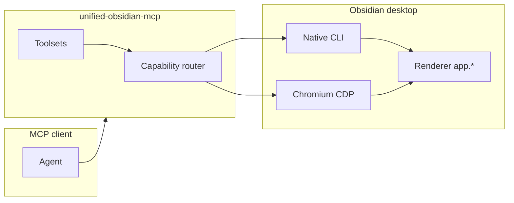

# unified-obsidian-mcp

MCP server that drives a **live Obsidian desktop app** for plugin development: native CLI commands, Playwright browser automation over CDP, telemetry with cursor-based tailing, and composite dev-cycle tools.

> This project is not affiliated with Obsidian or Dynalist Inc. “Obsidian” is a trademark of Dynalist Inc.

## Why two transports?

Obsidian exposes two complementary automation surfaces. The server uses both; each tool picks the layer that can actually perform the work.

| Transport               | Enables                                                                                                                              | Tradeoffs                                                                                                                                                                          |
| ----------------------- | ------------------------------------------------------------------------------------------------------------------------------------ | ---------------------------------------------------------------------------------------------------------------------------------------------------------------------------------- |
| **Obsidian CLI**        | ~100+ purpose-built commands, plugin reload, vault-scoped ops, live `__completions` (including plugin `registerCliHandler` commands) | Requires global `"cli": true` in `obsidian.json`. Cannot run headlessly. When disabled, stdout is literally `Command line interface is not enabled.` (exit 0).                     |
| **Playwright over CDP** | Real mouse/keyboard input, actionability waiting, ARIA snapshots (`browser_*`), live console/network capture                         | Obsidian must be **cold-started** with `--remote-debugging-port`. Electron’s single-instance lock means adding the flag to an already-running app does nothing — fully quit first. |

Both can be active at the same time ([verified](docs/verified-environment.md)).



## Quickstart

1. Install the MCP server in your client (below).
2. In chat, run **`obsidian_doctor`** and follow each remediation (or the suggested `fixedBy` tool).
3. Run **`obsidian_launch`** if CDP is not up.
4. Develop: link with **`obsidian_link_plugin`**, build locally, verify with **`obsidian_dev_cycle`**.

Bundled **skills**, **commands**, and **agents** under this package teach the loop in more detail.

## Install

### Cursor (one-click deeplink)

Cursor’s public MCP directory is manually reviewed; the fastest path is the install deeplink for the root `.mcp.json` server block:

[Install unified-obsidian-mcp in Cursor](cursor://anysphere.cursor-deeplink/mcp/install?name=obsidian&config=eyJtY3BTZXJ2ZXJzIjp7Im9ic2lkaWFuIjp7ImNvbW1hbmQiOiJucHgiLCJhcmdzIjpbIi15IiwidW5pZmllZC1vYnNpZGlhbi1tY3BAbGF0ZXN0Il19fX0=)

Equivalent config (what the base64 decodes to):

```json
{
  "mcpServers": {
    "obsidian": {
      "command": "npx",
      "args": ["-y", "unified-obsidian-mcp@latest"]
    }
  }
}
```

Or copy [`.mcp.json`](.mcp.json) into your project, or add the same block in **Cursor Settings → MCP**.

Optional plugin bundle (skills, rules, commands): install from this repository via `.cursor-plugin/plugin.json` (folder discovery for `skills/` — no manifest `skills` field).

### Claude Code

```bash
# User scope
claude mcp add obsidian -- npx -y unified-obsidian-mcp@latest

# Project scope — uses .mcp.json in repo root
claude mcp add obsidian --scope project -- npx -y unified-obsidian-mcp@latest
```

Marketplace metadata: [`.claude-plugin/marketplace.json`](.claude-plugin/marketplace.json).

### Codex

Add the server via [`.mcp.json`](.mcp.json). Plugin manifest: [`.codex-plugin/plugin.json`](.codex-plugin/plugin.json). Repo marketplace entry: [`.agents/plugins/marketplace.json`](.agents/plugins/marketplace.json).

### npm

```bash
npx -y unified-obsidian-mcp@latest
```

Requires **Node.js 20+** and a running Obsidian **1.12+** with CLI support.

### From source

```bash
git clone https://github.com/slate-rehm/unified-obsidian-browser.git
cd unified-obsidian-browser
npm install && npm run build
node dist/cli.js
```

Point your MCP client at `node /absolute/path/to/dist/cli.js` instead of `npx`.

## Configuration

Set options via **environment variables** (and a subset via CLI flags). See [docs/configuration.md](docs/configuration.md) for examples.

| Setting             | Env var                | CLI flag         | Default                        |
| ------------------- | ---------------------- | ---------------- | ------------------------------ |
| CDP URL             | `OBSIDIAN_CDP_URL`     | `--cdp-url`      | `http://127.0.0.1:9222`        |
| Obsidian binary     | `OBSIDIAN_BIN`         | `--obsidian-bin` | OS default                     |
| Default vault       | `OBSIDIAN_VAULT`       | `--vault`, `-v`  | (active / unset)               |
| Toolsets            | `UOB_TOOLSETS`         | `--toolsets`     | `core,ui,telemetry,plugin-dev` |
| Log level           | `UOB_LOG_LEVEL`        | `--log-level`    | `info`                         |
| Telemetry buffer    | `UOB_TELEMETRY_BUFFER` | —                | `2000`                         |
| CDP reconnect delay | `UOB_RECONNECT_MS`     | —                | `2000`                         |
| Screenshot dir      | `UOB_SCREENSHOT_DIR`   | `--output-dir`   | `./.unified-obsidian-mcp`      |
| CLI timeout         | `UOB_CLI_TIMEOUT_MS`   | —                | `15000`                        |

Cursor plugin `variables` and Claude `userConfig` do not unify across hosts — use plain env vars in each MCP config.

## Toolsets

Gating keeps tool count manageable for model tool selection.

| Toolset      | Default | Description                                                                                                          |
| ------------ | ------- | -------------------------------------------------------------------------------------------------------------------- |
| `core`       | yes     | Status, doctor, launch, eval, CLI, commands, attach                                                                  |
| `ui`         | yes     | `browser_*` (from `@playwright/mcp`) for real UI interaction, plus `obsidian_snapshot`                               |
| `telemetry`  | yes     | Console/error/network capture, cursor tailing                                                                        |
| `plugin-dev` | yes     | Reload, manifest/settings, `obsidian_dev_cycle`, exercise/reset                                                      |
| `vault`      | no      | Note/file CRUD, search, tabs, graph queries — **opt-in** because other Obsidian MCP servers already cover vault CRUD |
| `devtools`   | no      | DOM/CSS/CDP passthrough, OS-window screenshots, mobile emulation                                                     |
| `authoring`  | no      | Themes, snippets, properties, tags, tasks, daily notes, templates                                                    |

Enable extras: `UOB_TOOLSETS=core,ui,telemetry,plugin-dev,vault` or `--toolsets all`.

### Representative tools (default toolsets)

**Core & provisioning:** `obsidian_status`, `obsidian_doctor`, `obsidian_launch`, `obsidian_setup_cli`, `obsidian_setup_vault`, `obsidian_link_plugin`, `obsidian_list_targets`, `obsidian_attach`, `obsidian_eval`, `obsidian_cli`, `obsidian_commands`, `obsidian_command`

**Plugin dev:** `obsidian_plugin_list`, `obsidian_plugin_manifest`, `obsidian_plugin_settings`, `obsidian_plugin_reload`, `obsidian_dev_cycle`, `obsidian_exercise_command`, `obsidian_reset_state`, `obsidian_plugin_health`

**Telemetry:** `obsidian_logs`, `obsidian_log_mark`, `obsidian_logs_clear`, `obsidian_telemetry_status`

**UI:** `obsidian_snapshot` (scoped to a leaf, modal, or settings tab), plus `browser_snapshot`, `browser_click`, `browser_type`, `browser_press_key`, `browser_take_screenshot`, … — **27** tools proxied from `@playwright/mcp` (plus a few Obsidian-native helpers like `browser_reload`), with the destructive ones (`browser_close`, `browser_navigate`, `browser_resize`, file upload, raw code execution) deliberately withheld because they would close, navigate away from, or resize the user's real Obsidian window. `browser_take_screenshot` captures web contents; `obsidian_screenshot` (devtools toolset) captures the OS window via Electron `capturePage()`.

**Vault (opt-in):** `obsidian_search`, `obsidian_read`, `obsidian_create`, and related file/note tools

**Authoring (opt-in):** `obsidian_properties`, `obsidian_tags`, `obsidian_tasks`, themes, daily notes

Browser tools are **snapshot-first**: call `browser_snapshot` (or the cheaper scoped `obsidian_snapshot`), then pass the returned ref as **`target`** (CSS selectors also work there). Prefer `obsidian_command` over menu clicking.

## Troubleshooting

`obsidian_doctor` classifies failures into four distinct precondition states — do not treat them as a generic “cannot connect”:

| State                    | Symptom                                                                   | Fix                                                                                     |
| ------------------------ | ------------------------------------------------------------------------- | --------------------------------------------------------------------------------------- |
| **Obsidian not running** | `OBSIDIAN_NOT_RUNNING`                                                    | `obsidian_launch`                                                                       |
| **CLI disabled**         | `CLI_DISABLED`, or stdout marker `Command line interface is not enabled.` | `obsidian_setup_cli` or Settings → Advanced → Command line interface                    |
| **CDP port closed**      | `CDP_PORT_CLOSED`, attach timeouts                                        | Quit Obsidian completely; cold start with `--remote-debugging-port` (`obsidian_launch`) |
| **Argv corruption**      | `ARGV_CORRUPTION`, `Command "-foo" not found`                             | Fix `user-flags.conf` to use `--double-dash` flags                                      |

Also:

- **`VAULT_NOT_FOUND`** — vault name not in `obsidian.json` registry.
- **Stale UI refs** — `STALE_REF`; take a new `browser_snapshot`.
- **Linux wrappers** — single-dash tokens in `user-flags.conf` break every CLI call.

## Version drift caveat

Obsidian checks for updates on startup and hourly. A downloaded `obsidian-<version>.asar` in userData takes precedence over the distro package, so DOM and API behavior can drift from the version your package manager reports. Re-run doctor and UI smoke tests after upgrades.

## Plugin release versioning

npm uses `package.json` `version`. Plugin manifests **must pin the same version** or hosts may show `unknown`:

- [`.cursor-plugin/plugin.json`](.cursor-plugin/plugin.json)
- [`.claude-plugin/plugin.json`](.claude-plugin/plugin.json)
- [`.codex-plugin/plugin.json`](.codex-plugin/plugin.json)
- [`server.json`](server.json) `version` and npm package entry

On each release, bump `version` in all four files together with `package.json` (not duplicated here — edit `package.json` in the release PR).

## MCP Registry

[`server.json`](server.json) lists `io.github.slate-rehm/unified-obsidian-mcp` for the [MCP Registry](https://modelcontextprotocol.io/registry/about) (npm package `unified-obsidian-mcp`, stdio transport).

## Security

This server executes against your local Obsidian instance. Tools such as `obsidian_eval` and proxied CDP capabilities are powerful by design. Use a dev vault, review tool approvals in your client, and see [SECURITY.md](SECURITY.md) if present.

## License

MIT
